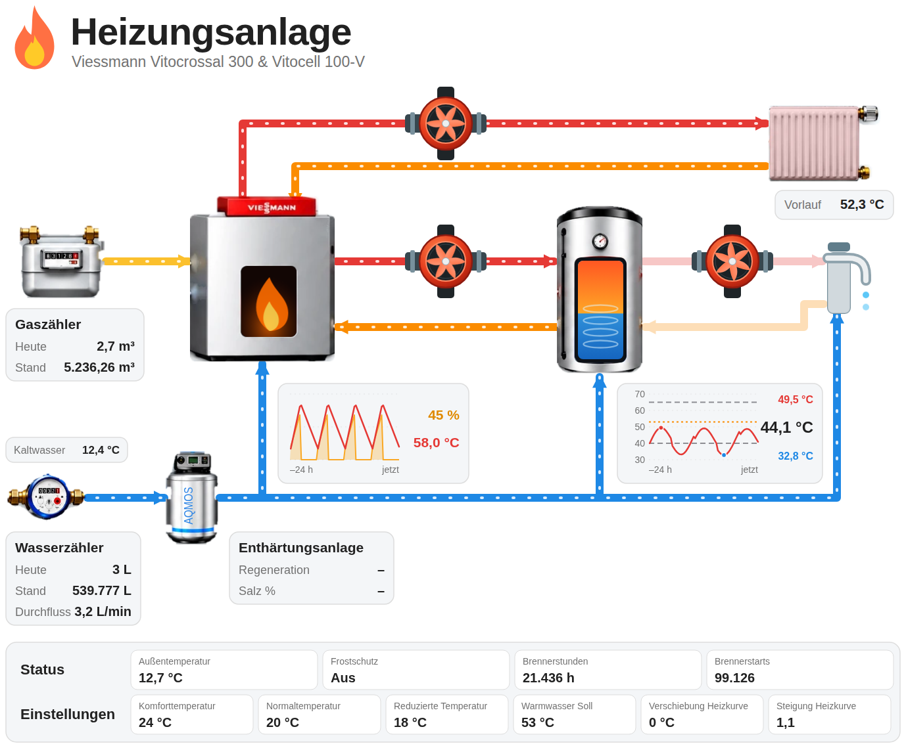
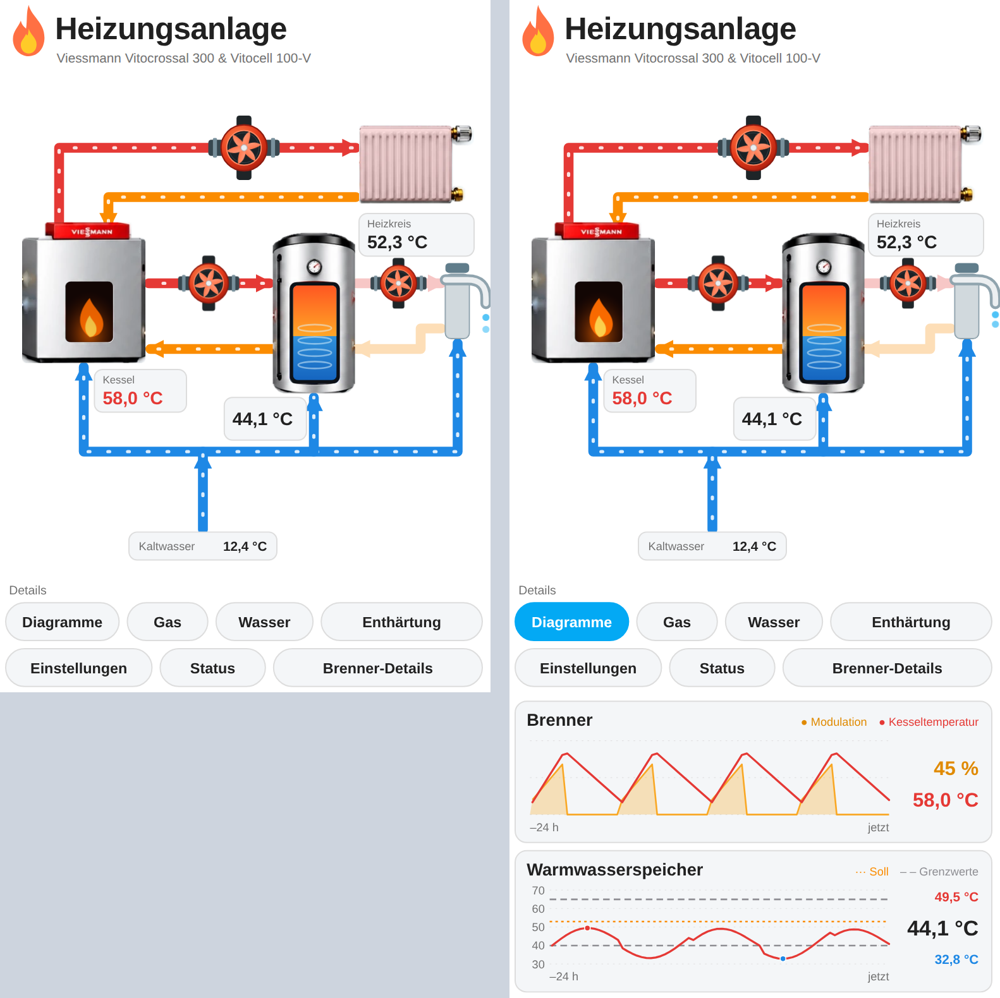

# Heizungskeller Schema

Eine Home-Assistant-Karte (`custom:heizungsanlage-card`), die eine Gas-/Ölheizung als
animiertes Anlagenschema darstellt: Kessel, Warmwasserspeicher, Pumpen, Heizkörper,
Gas- und Wasserzähler, Enthärtungsanlage – mit Live-Werten und Verläufen.




> Die Standardwerte der Karte passen zu einer Viessmann-Anlage
> mit der ViCare-Integration (Vitocrossal 300 & Vitocell 100-V), lassen sich aber komplett im
> visuellen Editor anpassen.

## Funktionen

- **Animierte Leitungen:** Heizkreis, Ladekreis, Zirkulation und Kaltwasser laufen nur, wenn die jeweilige Pumpe bzw. der Durchfluss aktiv ist.
- **Pumpen mit drehendem Flügelrad**, solange sie laufen.
- **Brenner:** Flamme im Sichtfenster, Größe folgt der Modulation. Darunter ein 24-h-Graph mit Modulation und Kesseltemperatur.
- **Warmwasserspeicher:** Füllanzeige, 24-h-Verlauf mit Soll-Linie, zwei grauen Grenzlinien sowie Maximum, Istwert und Minimum.
- **Einheiten umgerechnet:** Der Wasserzähler zeigt den Stand in m³ mit zwei Nachkommastellen und den Durchfluss in ℓ/h, egal in welcher Einheit der Sensor liefert (L, m³; m³/h, l/min, l/h …). Liter werden mit dem Symbol ℓ geschrieben, damit es nicht mit einem großen I verwechselt wird.
- **Einheiten linksbündig:** In Boxen mit mehreren Zahlenwerten stehen die Einheiten linksbündig untereinander, die Zahlen rechtsbündig davor.
- **Gas und Wasser aus dem Energie-Dashboard** (Stand und Tagesverbrauch), ohne zusätzliche Konfiguration.
- **Kompakte Ansicht** für Handy und kleine Hochformat-Displays mit aufklappbaren Details.
- **Untere Leiste:** Status (Außentemperatur, Frostschutz, Brennerstunden, Brennerstarts) und Einstellungen (Heizkurve, Temperaturen).
- Ein Klick auf jeden Wert öffnet den normalen Home-Assistant-Entitätsdialog.

## Installation

### Über HACS (empfohlen)

Mit einem Klick (über My Home Assistant öffnet sich das Repository direkt in HACS deiner Home-Assistant-Instanz):

[](https://my.home-assistant.io/redirect/hacs_repository/?owner=BeGiBue&repository=heizungskeller-schema&category=plugin)

Danach „Herunterladen" wählen und den Browser-Cache leeren (bzw. die App neu laden).

Oder von Hand:

1. HACS öffnen → Menü (⋮) → **Benutzerdefinierte Repositories**.
2. URL `https://github.com/BeGiBue/heizungskeller-schema` eintragen, Kategorie **Dashboard** wählen.
3. „Heizungskeller Schema" installieren und den Browser-Cache leeren (bzw. die App neu laden).

HACS legt die Ressource automatisch an.

### Manuell

1. `dist/heizungsanlage-card.js` nach `/config/www/` kopieren.
2. *Einstellungen → Dashboards → ⋮ → Ressourcen* → Ressource hinzufügen:
   URL `/local/heizungsanlage-card.js`, Typ **JavaScript-Modul**.
3. Browser-Cache leeren.

## Einrichtung ohne YAML

Karte hinzufügen → **Heizungsanlage** wählen. Alle Einstellungen stehen im visuellen Editor
bereit, aufgeteilt in aufklappbare Bereiche (Allgemein, Status, Kessel & Brenner, Pumpen,
Warmwasserspeicher, Einstellungen, Gas & Wasser, Enthärtungsanlage). Die Felder nutzen die
Standard-Auswahlelemente von Home Assistant (Entitätsauswahl, Zahlenfelder).

Wird ein Feld geleert, wird die Entität bewusst abgewählt: Das zugehörige Element zeigt dann „–"
und löst keine Animation aus.

### Breite im Sections-Dashboard

Die Karte füllt die volle Breite ihres Abschnitts. Für die Breite von zwei Sektionen dem
Abschnitt die Breite **2 Spalten** geben (YAML: `column_span: 2`). Die Höhe passt sich
automatisch an.

### Layout: breit und kompakt

Die Karte wählt ihr Layout nach der verfügbaren Breite (Einstellung **Layout** im Editor):

- **Breit** (ab ca. 700 px, z. B. Tablet oder Desktop): vollständiges Schema mit allen Geräten,
  Diagrammen, Datenboxen und der unteren Leiste.
- **Kompakt** (unter ca. 700 px, z. B. Handy oder 7"-Display im Hochformat): Kerngeräte mit großen Zahlen
  (Vorlauf, Kessel, Speicher, Kaltwasser) sowie Gaszähler (links unten), Wasserzähler (rechts unten) und
  Enthärtungsanlage im Schema. Ein Tipp auf ein Gerät öffnet den passenden Bereich darunter. Alle weiteren Werte stehen hinter Schaltflächen:
  *Diagramme*, *Status*, *Einstellungen* (erste Zeile) sowie *Brenner*, *Gas*, *Wasser* und *Enthärtung* (zweite Zeile).
  Ein Tipp klappt den jeweiligen Bereich unter den Schaltflächen auf, ein zweiter Tipp schließt ihn.

Mit `layout: wide` oder `layout: compact` lässt sich das Layout fest vorgeben.

Im breiten Layout wird das Schema auf die Bildschirmhöhe verkleinert, damit es z. B. auf dem iPad im Querformat ohne Scrollen
vollständig zu sehen ist (`fit_screen`, standardmäßig an). Der Abzug für Kopfzeile und Ränder lässt sich mit `screen_offset`
(Pixel, Standard 32) anpassen; mit `fit_screen: false` wird die Anpassung abgeschaltet.

## YAML-Konfiguration (optional)

```yaml
type: custom:heizungsanlage-card
layout: auto              # auto | wide | compact
fit_screen: true          # breites Layout auf die Bildschirmhöhe verkleinern (kein Scrollen)
screen_offset: 32          # Abzug von der Bildschirmhöhe in px
title: Heizungsanlage
subtitle: Viessmann Vitocrossal 300 & Vitocell 100-V
tank_range: [20, 65]      # Temperaturbereich der Füllanzeige im Speicher (°C)
limit_offset: 5           # graue Grenzlinien: Mindest-Soll minus 5 K, Maximal-Soll plus 5 K
entities:
  outside_temp: sensor.vicare_outside_temperature
  frost_protection: binary_sensor.vicare_frost_protection_active
  burner_hours: sensor.vicare_burner_hours
  burner_starts: sensor.vicare_burner_starts
  burner_active: binary_sensor.vicare_burner_active
  burner_modulation: sensor.vicare_burner_modulation
  boiler_temp: sensor.vicare_boiler_temperature
  supply_temp: sensor.vicare_supply_temperature
  heating_pump: binary_sensor.vicare_circulation_pump_active
  charge_pump: binary_sensor.vicare_dhw_pump_active
  dhw_circ_pump: binary_sensor.vicare_dhw_circulation_pump_active
  tank_temp: sensor.vscotho1_72_ww_speichertemperatur
  tank_target: number.vscotho1_72_warmwassertemperatur
  tank_min_target: sensor.vicare_hot_water_min_temperature
  tank_max_target: sensor.vicare_hot_water_max_temperature
  comfort_temp: number.vscotho1_72_komforttemperatur
  normal_temp: number.vscotho1_72_normaltemperatur
  reduced_temp: number.vscotho1_72_reduzierte_temperatur
  curve_slope: number.vscotho1_72_steigung_der_heizkurve
  curve_shift: number.vscotho1_72_verschiebung_der_heizkurve
  water_flow: sensor.wasserzahler_flow
  water_temp: sensor.wasserzahler_water_temperature
  # Gas und Wasser kommen automatisch aus dem Energie-Dashboard.
  # Nur eintragen, wenn andere Entitäten verwendet werden sollen:
  # gas_total: sensor.…
  # gas_today: sensor.…
  # water_total: sensor.…
  # water_today: sensor.…
  # Optional (Tafel der Enthärtungsanlage):
  # softener_regeneration: sensor.…
  # softener_salt: sensor.…
```

Im Editor werden nur Abweichungen von den Standardwerten in die YAML-Konfiguration geschrieben.

### Welche Entität schaltet was?

| Animation / Anzeige | Auslöser |
|---|---|
| Flamme und Glühen im Brennerfenster | `burner_active` ist an oder `burner_modulation` > 0 |
| Flammengröße | `burner_modulation` |
| Gasleitung | Brenner aktiv |
| Heizkreis-Leitungen, Pumpenrad, Heizkörper-Tönung | `heating_pump` |
| Ladekreis zum Speicher, Pumpenrad | `charge_pump` |
| Warmwasser-Zirkulation, Pumpenrad | `dhw_circ_pump` |
| Kaltwasserleitungen, Tropfen am Hahn | `water_flow` > 0 |
| Füllung im Speicherfenster | `tank_temp` (zwischen `tank_range`) |

## Hinweise

- Die Verläufe (24 h) werden alle 5 Minuten über die Recorder-Datenbank neu geladen; die Entitäten müssen dafür im Verlauf aufgezeichnet werden.
- Werte werden mit der nativen Formatierung von Home Assistant angezeigt (Sprache, Einheit, Anzeige-Genauigkeit der Entität).
- Die Gerätegrafiken sind als Bilder in die JavaScript-Datei eingebettet, es werden keine weiteren Dateien nachgeladen.
- Texte in der Karte sind deutsch; der Editor ist deutsch und englisch.

## Entwicklung

Die Karte besteht aus **einer** Datei, `dist/heizungsanlage-card.js` (kein Build-Schritt). Arbeitsanweisungen für
Claude Code stehen in `CLAUDE.md`, Anlage, Entitäten und Design-Entscheidungen in `CONTEXT.md`.

```bash
npm run check      # Syntax prüfen
npm test           # Editor und beide Layouts im Headless-Browser testen (Playwright)
npm run preview    # Vorschaubilder mit Testdaten nach tools/out/ rendern
python3 tools/images.py extract   # eingebettete Gerätebilder nach assets/devices/ herausziehen
python3 tools/images.py embed     # Bilder wieder einbetten
```

Für Vorschau und Tests: `pip install playwright pillow` und `playwright install chromium`.
In Claude Code stehen dazu die Befehle `/vorschau` und `/release` bereit (`.claude/commands/`).
